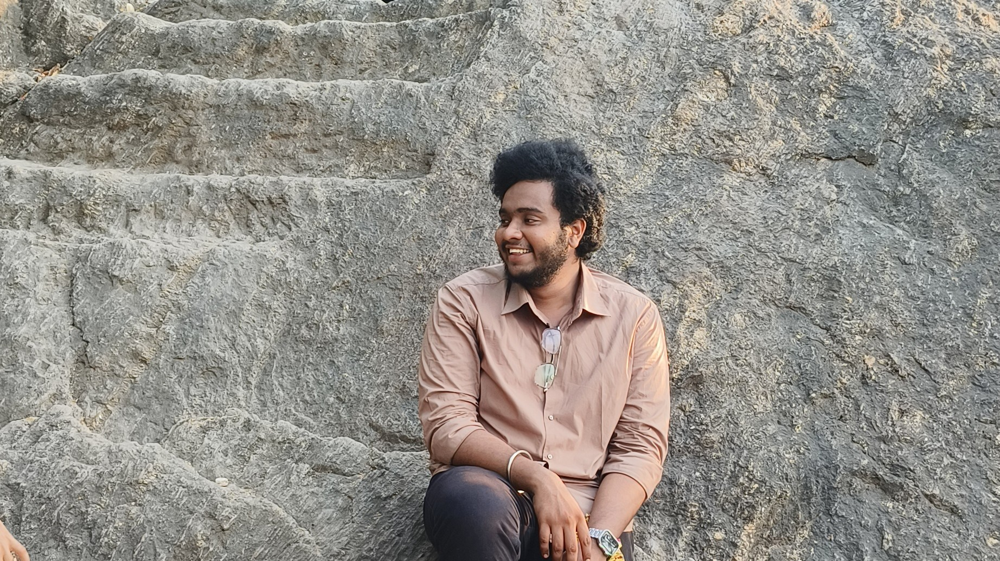

<!-- Fancy Header with Emojis -->
<h1 align="center">Hi there 👋, I'm Midhun Yentrapati</h1>
<h3 align="center">🚀 Tech Explorer | 🧠 ML Enthusiast | 🎯 Community Builder</h3>

  

---

### 💡 About Me

- 🎓 AIML Undergrad from SR Gudlavalleru Enginerring College  
- 🧠 Passionate about AI, ML, DL, Prompt Engineering 

---

### 🛠️ Tech Stack

   Python

   Django

   React

   Tailwind CSS

   HTML5

   CSS3

   GitHub

---

### ✨ Fun Facts

- 🧃 Fuelled by Coffee
- 🛠️ Builds better when the deadline is tight 😅
- 🧠 Believes in “Learn → Build → Share” cycle
- 💬 I love exploring

---

### 📫 Connect with Me

  
  
  

---

💖 Thanks for visiting my GitHub! Let's build something awesome together.

